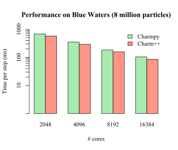

============
Benchmarks
============

.. contents::

This section presents Charm4py benchmark results using: (a) real examples and miniapps;
(b) synthetic test cases to evaluate specific features.

Mini-apps
---------

LeanMD - Molecular Dynamics
~~~~~~~~~~~~~~~~~~~~~~~~~~~

We have ported the LeanMD_ Charm++ mini-app to Charm4py, with all the code written
in Python. The physics functions are JIT compiled by Numba_. The code is currently
available in the ``leanmd-experimental`` branch of Charm4py.

Here we compare the performance between the C++ and Python versions.
First we ran a *strong scaling* problem on `Blue Waters`_ with 8 million particles,
obtaining the following results:

As we can see, the performance and scaling characteristics of Charm4py closely mimic
the behavior of the C++ program. The y axis is logarithmic scale, and we can see that
performance scales linearly with the number of cores. The average performance difference
between Charm4py and Charm++ is 19%.

We also ran a different problem size (51 million particles) and configuration to
evaluate performance with very high core counts (131k cores on Blue Waters),
obtaining the following results:

+---------------+----------------------+
|    Version    |  Time per step (ms)  |
+===============+======================+
|  charm4py     |      438             |
+---------------+----------------------+
|  Charm++      |      458             |
+---------------+----------------------+

Here we can see that Charm4py performs better than C++. At this core count, parallel
overhead becomes significant and Charm4py benefits from a feature that is not yet implemented
in the C++ version of Charm. The feature allows aggregation of receives to local objects
in the same *section*, thus reducing overhead.

.. _leanmd: http://charmplusplus.org/miniApps/

.. _Numba: https://numba.pydata.org/

.. _Blue Waters: http://www.ncsa.illinois.edu/enabling/bluewaters

Features
--------

Bypass pickling for NumPy and other arrays
~~~~~~~~~~~~~~~~~~~~~~~~~~~~~~~~~~~~~~~~~~

This feature is also known as "direct-copy". As explained in :ref:`perf-serialization-label`,
it is used when NumPy arrays and other structures supporting the buffer protocol are passed
as arguments of remote methods.

To test and evaluate the performance of this feature we wrote a small program
(``tests/test_dcopy.py``) where a chare array is created, and each element
sends three large data arrays to the rest of the elements, for a fixed number of iterations.
The experiment was carried out using 4 cores on a standard Macbook Pro. The results
are shown below (for 10 iterations):

+--------------------------+-----------------+--------------+----------------+
|         Metric           |  Without dcopy  |  With dcopy  |    speedup     |
+==========================+=================+==============+================+
|  Send time (s)           |      2.406      |    1.046     |     2.3002     |
+--------------------------+-----------------+--------------+----------------+
|  Receive time (s)        |      0.372      |    0.343     |     1.0845     |
+--------------------------+-----------------+--------------+----------------+
|  Total program time (s)  |     12.72804    |   11.21846   |     1.1346     |
+--------------------------+-----------------+--------------+----------------+
|  Bytes sent (MB)         |     1339.892    |   1339.323   |     1.0004     |
+--------------------------+-----------------+--------------+----------------+

Note: this feature is enabled by default with Python 3 and Cython/CFFI layers.
