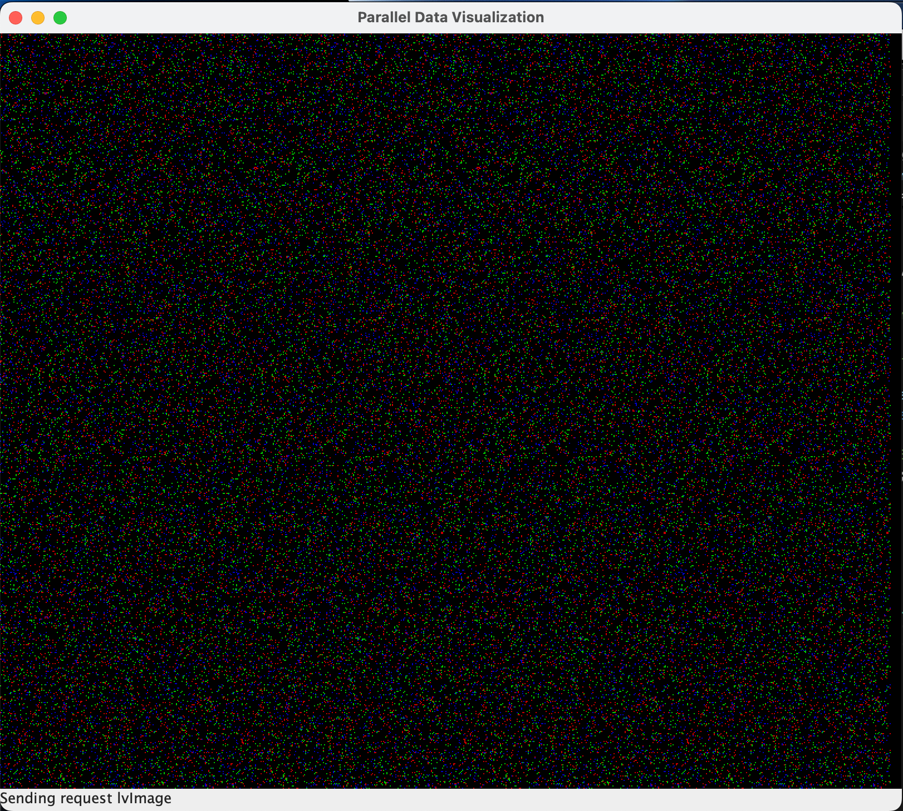

## Instructions for Running the LiveViz Example

### Step 1: Set Up Python Environment

Activate your Python virtual environment if you're using one

### Step 2: Launch LiveViz Server

Start the server with the following command, replacing `<N>` with the number of processors and `<PORT>` with your desired port:

```bash
python -m charmrun.start +p<N> ++server ++local liveviz.py ++server-port <PORT>
```

### Step 3: Capture Server Details

After running the command above, note down the displayed **Server IP** and **Server Port** (the port will match the one specified earlier if you used `++server-port`).

### Step 4: Clone and Build CCS Tools

Clone the `ccs_tools` repository:

```bash
git clone https://github.com/UIUC-PPL/ccs_tools.git
cd ccs_tools
ant
```

### Step 5: Run the LiveViz Client

Launch the client application using the captured server details:

```bash
./liveViz <SERVER_IP> <SERVER_PORT>
```

### Step 6: Verify Visualization

The LiveViz client will connect to the server and display a live visualization of the transmitted data, similar to the image below:



Ensure your setup matches the displayed output.
