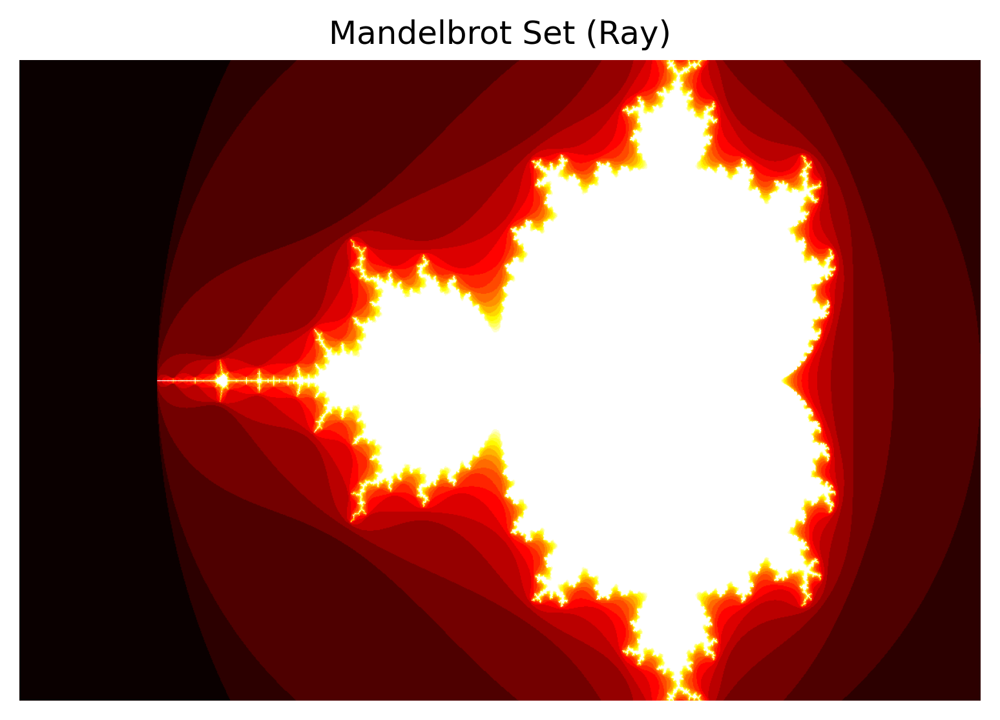

==================
Mandelbrot example
==================

mandelbrot.py <height> <width> <max_iter> <tile_size>
    - height - height of image
    - width - width of image
    - max_iter - determines the "defintion" of zoom
    - tile_size - parallelization factor. each tile is computed in parallel

    Generates mandelbrot.png - Computes a high-resolution image of the Mandelbrot set using parallel processing. It divides the image into smaller rectangular tiles and distributes these tiles across multiple worker tasks using Ray-Charm4py. Each task calculates whether each pixel in its tile belongs to the Mandelbrot set, storing the result in a memory-mapped file to avoid using excessive RAM. This approach enables efficient generation of very large fractal images by balancing performance and memory usage.

    